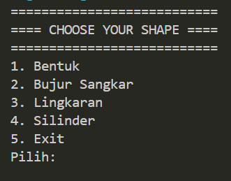
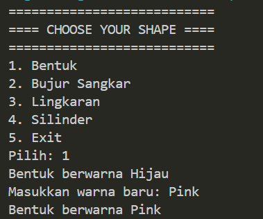
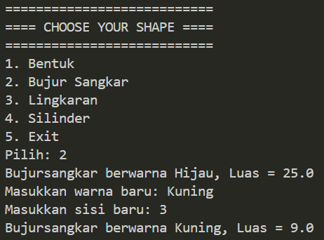
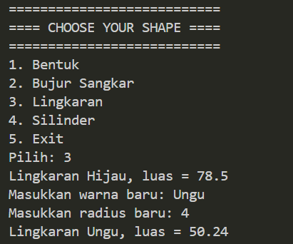
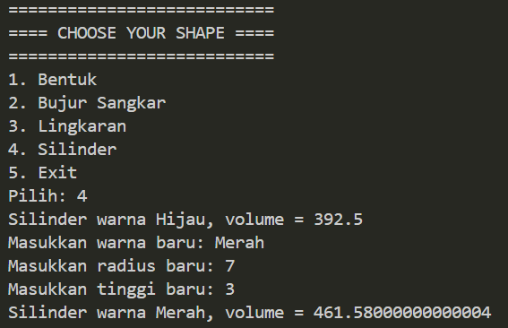
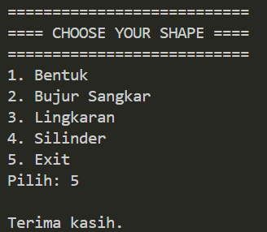

# Exercise - Exploration of Encapsulation and Inheritance

## Deskripsi
Program ini dibuat untuk memenuhi tugas mahasiswa semester 5 kelas A pada mata kuliah Pemrograman Berorientasi Objek (PBO) dengan topik materi **Encapsulation and Inheritance**.

Program merupakan simulasi sederhana untuk mengeksplorasi konsep Object-Oriented Programming menggunakan beberapa bentuk geometri, yaitu Bentuk, Bujur Sangkar, Lingkaran, dan Silinder.

Program menyediakan menu yang memungkinkan user untuk memilih bentuk, melihat informasi bentuk, serta mengubah atribut seperti warna, sisi, radius, dan tinggi. Program menggunakan konsep **encapsulation** melalui penggunaan atribut `private` yang diakses menggunakan getter dan setter, serta konsep **inheritance** melalui hubungan pewarisan antar class.

Struktur inheritance yang digunakan dalam program adalah:

Bentuk → Lingkaran → Silinder

Sedangkan Bujur Sangkar merupakan turunan langsung dari class Bentuk.

## Struktur Program

Program terdiri dari 5 class, yaitu:


### Bentuk.java

Class dasar (parent class) yang menyimpan atribut `warna` dan menyediakan method untuk mendapatkan, mengubah, serta menampilkan warna bentuk.

Method yang terdapat pada class ini:

- `getWarna()` digunakan untuk mendapatkan nilai warna.
- `setWarna()` digunakan untuk mengubah nilai warna.
- `printInfo()` digunakan untuk menampilkan informasi bentuk.

### BujurSangkar.java

Class turunan dari `Bentuk` yang memiliki atribut `sisi`.

Class ini digunakan untuk menghitung luas bujur sangkar serta menampilkan informasi bujur sangkar.

Method yang terdapat pada class ini:

- `getSisi()` digunakan untuk mendapatkan nilai sisi.
- `setSisi()` digunakan untuk mengubah nilai sisi.
- `hitungLuas()` digunakan untuk menghitung luas bujur sangkar.
- `printInfo()` digunakan untuk menampilkan informasi bujur sangkar.

### Lingkaran.java

Class turunan dari `Bentuk` yang memiliki atribut `radius`.

Class ini digunakan untuk menghitung luas lingkaran. Class ini juga memiliki konstanta kelas `phi` dengan nilai `3.14`.

Method yang terdapat pada class ini:

- `getRadius()` digunakan untuk mendapatkan nilai radius.
- `setRadius()` digunakan untuk mengubah nilai radius.
- `hitungLuas()` digunakan untuk menghitung luas lingkaran.
- `printInfo()` digunakan untuk menampilkan informasi lingkaran.

### Silinder.java

Class turunan dari `Lingkaran`. Class ini memiliki atribut tambahan yaitu `tinggi`.

Karena `Silinder` merupakan turunan dari `Lingkaran`, class ini mewarisi atribut dan method yang dimiliki oleh `Lingkaran`, termasuk `radius`, `getRadius()`, `setRadius()`, dan konstanta `phi`.

Method yang terdapat pada class ini:

- `getTinggi()` digunakan untuk mendapatkan nilai tinggi.
- `setTinggi()` digunakan untuk mengubah nilai tinggi.
- `hitungVolume()` digunakan untuk menghitung volume silinder.
- `printInfo()` digunakan untuk menampilkan informasi silinder.

### Main.java

Merupakan class utama yang menjalankan program.

Class `Main` menggunakan `Scanner` untuk menerima input dari user dan menyediakan menu pilihan untuk membuat object `Bentuk`, `BujurSangkar`, `Lingkaran`, atau `Silinder`.

## Konsep Encapsulation

Encapsulation merupakan konsep OOP yang menggabungkan data dan method yang berhubungan ke dalam sebuah class serta membatasi akses langsung terhadap data tersebut.

Pada program ini, konsep encapsulation diterapkan pada atribut:

```java
private double sisi;
private double radius;
private double tinggi;
```

## Konsep Inheritance

Inheritance merupakan konsep OOP yang memungkinkan sebuah class mewarisi atribut dan method dari class lain.

Pada program ini, inheritance diterapkan menggunakan keyword extends.

Keyword super digunakan untuk memanggil constructor atau anggota dari superclass.

Struktur Inheritance pada program seperti berikut:

                         Bentuk
                           │
              ┌────────────┴────────────┐
              │                         │
              ▼                         ▼
        BujurSangkar                Lingkaran
                                        │
                                        ▼
                                     Silinder
## Method Overriding

Selain inheritance, program juga menggunakan method overriding.

Method printInfo() yang terdapat pada class Bentuk diwariskan kepada subclass. Method tersebut kemudian ditulis ulang pada class BujurSangkar, Lingkaran, dan Silinder menggunakan annotation @Override.

## Fitur Program
Program menyediakan 5 pilihan menu:

- Bentuk
- Bujur Sangkar
- Lingkaran
- Silinder
- Exit

## Flowchart Program
Start
  │
  ▼
Inisialisasi Scanner
  │
  ▼
┌─────────────────────────┐
│    CHOOSE YOUR SHAPE    │
├─────────────────────────┤
│ 1. Bentuk               │
│ 2. Bujur Sangkar        │
│ 3. Lingkaran            │
│ 4. Silinder             │
│ 5. Exit                 │
└────────────┬────────────┘
             │
             ▼
       Input Pilihan
             │
             ▼
       ┌─────────────┐
       │   Pilihan?  │
       └──────┬──────┘
              │
      ┌───────┼───────┬────────┬────────┐
      │       │       │        │        │
     1│      2│      3│       4│       5│
      ▼       ▼       ▼        ▼        ▼
   Bentuk   Bujur   Lingkaran Silinder  Exit
            Sangkar
      │       │       │        │
      ▼       ▼       ▼        ▼
 Tampilkan Tampilkan Tampilkan Tampilkan
    Info      Info      Info      Info
      │       │       │        │
      ▼       ▼       ▼        ▼
   Input    Input    Input    Input
   Warna    Warna    Warna    Warna
              │       │        │
              ▼       ▼        ▼
            Input    Input    Input
            Sisi     Radius   Radius
              │       │        │
              ▼       ▼        ▼
            Hitung   Hitung   Input
            Luas     Luas     Tinggi
                                  │
                                  ▼
                             Hitung Volume
      │       │       │        │
      └───────┴───────┴────────┘
              │
              ▼
        Tampilkan Hasil
              │
              ▼
       Kembali ke Menu
              │
              ▼
       ┌─────────────────┐
       │ Pilihan == 5 ?  │
       └────────┬────────┘
                │
           ┌────┴────┐
           │         │
         Tidak       Ya
           │         │
           ▼         ▼
      Kembali ke   Selesai
         Menu

# SCREENSHOT OUTPUT PROGRAM

### Menu


### Input Bentuk


### Input Bujur Sangkar


### Input Lingkaran


### Input Silinder


### Exit
